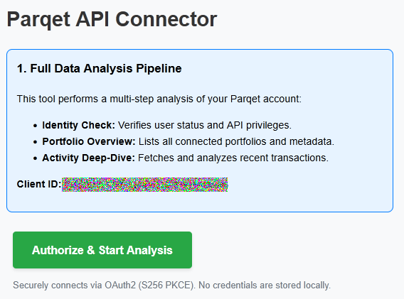

# **Parqet API Test Client**

A lightweight Python project designed to explore the features of the **Parqet Connect API**. This tool serves as a technical experiment (Proof-of-Concept) for implementing the secure **OAuth2 authentication process with PKCE (S256)**.

## 📸 Screenshots
*The landing page showing the Client ID and the authorization trigger.*

## **🛠 Project Structure**

The script automates the data retrieval process from Parqet and presents the results in a structured web dashboard. It performs a three-stage analysis:

1. **Identity Check**: Verifies user status and API permissions (scopes).  
2. **Portfolio Overview**: Lists all connected portfolios.  
3. **Activity Deep-Dive**: Fetches the most recent transactions from the first portfolio found.

## **📖 Background & API Reference**

This project is based on the official Parqet documentation. To use the API, the following steps are required in the [Parqet Developer Portal](https://developer.parqet.com):

1. **Organization & Integration**: Create an organization and an integration in the Console.  
2. **Client ID**: Copy the Client ID into the app.py file.  
3. **Redirect URI**: Add http://localhost:3000/callback as an authorized redirect URL.  
4. **Specifications**:  
   * [OpenAPI Specification (JSON)](https://developer.parqet.com/api-spec/current.json)  
   * [Developer Hub Overview](https://developer.parqet.com/llms.txt)

## **📦 Installation & Setup**

### **1\. Prerequisites**

Ensure that **Python 3.x** is installed.

### **2\. Prepare the Repository**

Clone the repository or download the files. Navigate to the project folder in your terminal.

### **3\. Install Dependencies**

Install the required libraries:  
pip install \-r requirements.txt

### **4\. Configuration**

Replace the CLIENT\_ID placeholder in app.py with your ID:  
CLIENT\_ID \= "xxxxxxxx-xxxx-xxxx-xxxx-xxxxxxxxxxxx"

## **🚦 Usage**

1. Start the local server:  
   python app.py

2. Open your browser at http://localhost:3000.  
3. Click on **"Authorize & Start Analysis"**.  
4. After logging in via Parqet, the analyzed data will be displayed in the dashboard.

## **🔒 Security Notes**

* **PKCE**: The tool uses the Proof Key for Code Exchange for a secure OAuth2 flow.  
* **Temporary  Storage**: The PKCE verifier is temporarily stored in a local file named verifier.txt. This file is used to verify the authenticity of the token request after the redirect..

*Note: This is a test project for educational purposes and is not officially affiliated with Parqet GmbH.*
